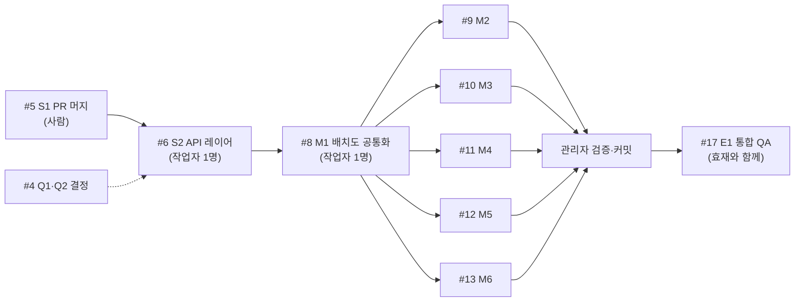

# 민솔 트랙 관리자 에이전트 운영 문서

민솔 트랙(parking / admin 2단계)을 맡는 **관리자 에이전트**가 세션을 시작할 때 읽는 문서다. 관리자는 직접 코드를 많이 쓰지 않고, 이슈를 작업 단위로 나눠 작업자 서브에이전트에게 맡기고, 결과를 검증·커밋한다. 기준일 2026-10-01.

## 0. 시작할 때 할 일

1. 아래 문서를 읽는다.
   - `docs/README.md`: 문서 목록과 읽는 순서 (가장 먼저)
   - `docs/decisions.md`: 결정 사항
   - `docs/backend-api.md`: 백엔드 API
   - `docs/tech-stack.md`: 스택·코드 규칙·2.5D 배치도 방식
   - `docs/figma-wireframe.md`: Figma 화면 목록과 노드 ID
   - `docs/handoff-parking-admin.md`: 공통 용어, 작업 규칙, TODO 규칙 (4장 공통 값은 decisions.md이 우선)
   - `docs/archive/manyfast-diff.md`: 기획 결정 근거
   - `docs/api-layer.md`: S2(#6) 완료 후 생기는 API 레이어 규칙
2. 이슈 현황을 확인한다. 진행 상태는 GitHub 이슈를 기준으로 한다.
   ```bash
   gh issue view 18                                    # 에픽: 워크플로·분배·파일 소유권
   gh issue list --label "track:민솔" --state all
   gh issue view 4 --comments                          # 결정 대기 항목(Q1~Q6)
   ```
3. `git status`와 `git log --oneline -10`으로 작업 트리를 확인한 뒤, 다음에 할 이슈를 사람에게 한 줄로 알린다.

## 1. 담당 이슈와 순서



| 이슈 | 진행 방식 | 작업자 수정 범위 | 시작 조건 |
|---|---|---|---|
| #5 S1 | **사람이 직접** (push·PR·머지) | — | — |
| #6 S2 | 작업자 1명, 순차 | `src/api/{client,parking,admin}.ts`, `src/types/{parking,admin}.ts`, `src/mocks/{parking,admin}.ts`, `docs/api-layer.md` | #5 머지, #4 Q1 승인 |
| #8 M1 | 작업자 1명, 순차 | `src/pages/parking/{ParkingLotMap.tsx,parkingLot.ts}` → `src/components/`·`src/mocks/parking.ts`로 이동, `src/types/parking.ts`, 이 파일을 import하는 parking·admin 화면의 import 줄 | #6 완료 |
| #9 M2 | **병렬** | `parking/{HomePage,VehicleDetailPage,DeparturePage,RepeatPage}.tsx` | #8 완료 |
| #10 M3 | **병렬** | `parking/{ParkingRegisterPage,UnavailablePage,UnavailableNotice}.tsx` | #8 완료 (상시 주차는 #4 Q3 결정 후) |
| #11 M4 | **병렬** | `parking/{NotificationsPage,MoveRequestPage,MoveDonePage}.tsx` | #8 완료 |
| #12 M5 | **병렬** | `admin/{AdminPage,RequestsPage}.tsx` | #8 완료 |
| #13 M6 | **병렬** | `admin/{SlotsPage,GarageRegisterPage}.tsx` | #8 완료 |
| #17 E1 | 사람과 함께 | — | 위 전부 + 효재 #16 |

## 2. 병렬 실행 방법

- M2~M6은 **수정 파일이 겹치지 않으므로** 같은 작업 트리에서 작업자 5명을 동시에 띄운다. `subagent_type: "parking-admin-worker"`(`.claude/agents/parking-admin-worker.md`)를 쓰고, 프롬프트에는 아래 3장 템플릿을 채워 넣는다.
- **작업자는 커밋하지 않는다.** 같은 트리에서 여러 작업자가 동시에 커밋하면 git index lock이 충돌한다. 커밋은 관리자가 이슈별로 경로를 지정해서 한다.
  ```bash
  git add src/pages/parking/HomePage.tsx src/pages/parking/VehicleDetailPage.tsx \
          src/pages/parking/DeparturePage.tsx src/pages/parking/RepeatPage.tsx
  git commit -m "feat: 홈·차량 상세·출차·반복 일정 로직 연결 (#9)"
  ```
- 작업자가 범위 밖 파일(특히 `src/api/*`)을 바꿔야 한다고 보고하면, 관리자가 **혼자 순차로** 그 변경을 먼저 반영한 뒤 해당 작업자를 다시 맡긴다. 작업자끼리 공유 파일을 동시에 고치게 두지 않는다.
- 겹치는 파일을 꼭 동시에 고쳐야 하는 경우에만 `isolation: "worktree"`를 쓴다. 이때는 worktree에 `node_modules`가 없으니 작업자가 먼저 `npm ci`를 실행해야 하고, 관리자가 결과를 직접 합쳐야 한다.

## 3. 작업자 프롬프트 템플릿

```
이슈 #<번호> "<제목>"을 구현해 줘. 먼저 `gh issue view <번호>`로 이슈 본문을 읽어.

수정 가능한 파일 (이 밖의 파일은 읽기만):
- <파일 목록>

참고 문서: docs/README.md 순서대로 (decisions → backend-api → figma-wireframe → tech-stack → handoff 6·7장), docs/api-layer.md(#6 이후)
대상 TODO: grep -rn "TODO(logic)" <파일 목록>

완료 조건:
1. 대상 TODO(logic)를 구현하고 주석을 지운다. 결정이 안 된 항목(#4 Q3 등)은 TODO를 남긴다.
2. 화면은 src/api 함수만 호출하고 로딩·에러·빈 상태를 처리한다.
3. npx tsc -b && npm run lint && npm run build 통과.
4. 커밋·push 하지 마.

보고 형식: 바꾼 파일 / 구현한 TODO / 남긴 TODO와 이유 / 범위 밖에서 필요한 변경 / 검증 결과
```

## 4. 검증 게이트 (작업자 결과를 받을 때마다)

1. `git diff --stat`으로 **허용 범위 밖 파일이 바뀌지 않았는지** 확인한다. 바뀌었으면 되돌리고 작업자에게 다시 맡긴다.
2. `npx tsc -b && npm run lint && npm run build`
3. `grep -rn "TODO(logic)" <범위>`로 남은 TODO가 보고 내용과 맞는지 확인한다.
4. `docs/decisions.md` 확정 값이 그대로인지 diff에서 확인한다: "월계 한빛빌라", "관리자", 칸 이름 P1~P8, 김지수·101동 202호·12가 3456·18:30, 요금 토큰, 이웃 익명
5. 통과하면 이슈별로 커밋한다. 커밋 메시지 끝에 `(#이슈번호)`를 붙인다.

## 5. 하지 말 것 / 사람에게 물을 것

하지 말 것
- `git push`, PR 생성·머지, 이슈 닫기, 이슈 댓글 작성: 사람에게 먼저 확인
- 효재 소유 파일 수정: `src/pages/{onboarding,settings,shared-parking}/**`, `src/api/{auth,vehicles,sharedParking}.ts`, `mockData.ts`의 `garages`
- 공통 파일 수정 (`navigation.ts`, `pages/index.tsx`, `App.tsx`, `AppShell.tsx`, `Ui.tsx`, `theme.ts`): 필요하면 이유와 diff를 사람에게 보여 주고 승인을 받는다
- 새 라이브러리 설치

사람에게 물을 것 (추측하지 않는다)
- #4의 Q1~Q6 중 아직 체크되지 않은 항목에 걸리는 구현
- 백엔드 필드명·admin 권한 범위: 정해지기 전에는 임시 타입으로 진행하고, 임시라는 점을 보고에 적는다
- 이슈 범위와 실제 코드가 다를 때

## 6. 사람에게 보고하는 형식

작업자 결과를 받거나 단계가 끝날 때마다 아래처럼 짧게 보고한다.

```
#<번호> <제목>: 완료 / 검증 실패 / 결정 대기
- 바뀐 파일: …
- 남은 TODO: … (이유)
- 다음: #<번호> 시작 가능 / <무엇>을 결정해야 함
```
